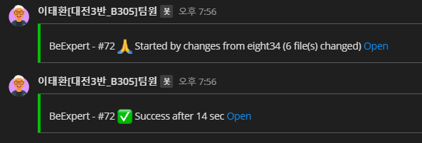

# CI/CD Jenkins 자료

[우아한 형제들 기술 블로그 참조](https://woowabros.github.io/experience/2018/06/26/bros-cicd.html)


CI(Continuous Integration)

1. Build, Test를 실시하는 프로세스를 말하며 통합 프로세스를 상시로 실시해 주는 것

CD(Continuous Delivery or Continuous Deploy)

1. 짧은 주기로 sw를 개발하는 공학적 접근의 하나
2. 신뢰가능한 수준으로 출시될 수 있도록 보증하기 위한 것
3. SW를 더 빠르게, 더 주기적으로 빌드하고 테스트하고 출시하는 것을 목표로 한다.	


## Jenkins의 장점

```markdown
- 무료 사용
- 방대한 양의 플로그인
- 다양한 적용사례 및 풍부한 레퍼런스
- Remote access API 제공
# - 사용자 정의 옵션
```


### AWS에 직접 설치한 이유

1. Docker를 사용해 설치할 경우, AWS의 backend forder에 접근하기 어려웠다.
2. Dockerfile을 사용해 여러가지 서버 설정을 할 필요성을 느끼지 못했다.


### Deploy 과정

1. develop branch에서 master branch로 merge request를 한다.

2. Gitlab에서 Jenkins로 webhook을 보낸다.

3. Jenkins에서 build를 시작한다.

   1. Execute shell

      ```bash
      # cd backend/Django
      # sudo docker build --tag void_back:0.1 .
      # cd ..
      cd backend
      sudo docker-compose down
      sudo docker-compose up -d db
      sudo docker-compose up -d backend1
      sudo docker-compose up -d backend2
      sudo docker-compose up -d adminer
      sudo docker-compose up -d nginx
      sudo docker image prune
      ```

4. Jenkins에서 build 시작, build 완료(성공, 실패)시 Mattermost로 message를 보낸다.
   


### 추가해야 할 부분

1. Jenkins에서 Pipeline을 이용한 Test.
2. Dockerfile을 이용한 서버설정.

